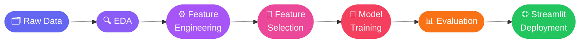

<div align="center">

# 📊 Customer Churn Prediction System

**End-to-end Machine Learning solution to identify at-risk customers — before they leave.**

[](https://python.org)
[](https://scikit-learn.org)
[](https://streamlit.io)
[](https://en.wikipedia.org/wiki/Receiver_operating_characteristic)
[](.)

[**🚀 Live Demo**](#-live-demo) · [**📂 Dataset**](#-dataset) · [**📈 Results**](#-model-performance) · [**▶️ Quick Start**](#️-quick-start)

---

</div>

## 🎯 Overview

Customer churn directly eats into revenue and growth. This project delivers a **full ML pipeline** — from raw behavioral data to a deployed, interactive prediction app — that flags at-risk customers before they leave.


---

## ✨ Features at a Glance

| Module | What it does |
|---|---|
| 🔍 **EDA** | Uncovers churn patterns across behavioral & transactional signals |
| ⚙️ **Feature Engineering** | Derives recency, frequency, and monetary indicators |
| 📌 **Feature Selection** | Reduces 250+ features to the most predictive subset |
| 🤖 **Model Training** | Trains and tunes a high-accuracy classifier |
| 📊 **Evaluation** | Validates with ROC-AUC, precision-recall, and confusion matrix |
| 🌐 **Streamlit App** | Business-friendly UI with real-time churn probability |
| 🚦 **Risk Tiers** | Actionable categories: Healthy / Needs Attention / High Risk |
| 💡 **Recommendations** | Per-customer retention suggestions |

---

## 🚀 Live Demo

<<<<<<< HEAD
> 🔗 **https://customer-churn-prediction-and-risk-analyzer-by-atharva-desai.streamlit.app/**
=======
> 🔗 **[Add your Streamlit Cloud URL here]**
>>>>>>> 1abe0ab (Updated churn prediction model)

---

## 📂 Dataset

Customer behavioral and transactional data covering engagement, purchasing, and revenue patterns.

<div align="center">

| Attribute | Detail |
|---|---|
| **Records** | 112,610 |
| **Features** | 250+ |
| **Target** | Customer Churn (binary) |
| **Type** | Behavioral & Transactional |

</div>

---

## 🔄 Pipeline



---

## 📈 Model Performance

<div align="center">

| Metric | Score |
|---|---|
<<<<<<< HEAD
| **ROC-AUC** | **0.856** ✅ |

</div>

> The model achieves a **ROC-AUC of 0.856**, demonstrating strong discrimination between churned and active customers on held-out data. This means the model correctly ranks a churning customer above an active one ~86% of the time.
=======
| **ROC-AUC** | **0.901** ✅ |

</div>

> The model achieves a **ROC-AUC of 0.901**, demonstrating strong discrimination between churned and active customers on held-out data. This means the model correctly ranks a churning customer above an active one ~90% of the time.
>>>>>>> 1abe0ab (Updated churn prediction model)

---

## 🖥️ Streamlit Application

The deployed app takes six intuitive business inputs and returns a churn probability with an actionable risk label.

### 🎛️ Input Features

| Feature | Business Meaning |
|---|---|
| Days Since Last Visit | How recently the customer engaged |
| Days Since Last Purchase | How recently they bought |
| Purchases This Month | Current purchase activity |
| Avg. Purchases (Last 3 Months) | Historical purchase trend |
| Revenue This Month | Monetary contribution |
| Visits This Month | Website / App engagement |

### 🚦 Risk Categories

| Churn Probability | Risk Level | Recommended Action |
|---|---|---|
| `< 10%` | 🟢 **Healthy** | Standard engagement |
| `10% – 20%` | 🟡 **Needs Attention** | Proactive outreach |
| `> 20%` | 🔴 **High Churn Risk** | Immediate retention offer |

---

## 📸 Screenshots

<<<<<<< HEAD
Home Page  


Prediction Results


 
=======
| Home Page | Prediction Results |
|---|---|
| _Add screenshot_ | _Add screenshot_ |
>>>>>>> 1abe0ab (Updated churn prediction model)

---

## 🛠️ Tech Stack

<div align="center">


</div>

---

## 📁 Project Structure

```
customer-churn-prediction/
│
├── 📄 app.py                        # Streamlit application
├── 📄 requirements.txt
├── 📄 README.md
│
├── 📦 models/
│   └── churn_model_simple.pkl       # Trained model artifact
│
├── 📓 notebooks/
│   ├── 01_EDA.ipynb
│   ├── 02_Preprocessing.ipynb
│   ├── 03_Feature_Selection.ipynb
│   ├── 04_Model_Building.ipynb
│   ├── 05_Evaluation.ipynb
│   └── 06_Top_Features_For_App.ipynb
│
└── 📂 data/
```

---

## ▶️ Quick Start

```bash
# 1. Clone the repo
git clone https://github.com/your-username/customer-churn-prediction.git
cd customer-churn-prediction

# 2. Install dependencies
pip install -r requirements.txt

# 3. Launch the app
streamlit run app.py
```

---

## 💼 Business Impact

- 📉 **Reduce revenue loss** by acting on churn signals early
- 🎯 **Target retention campaigns** at the right customers
- 📈 **Increase Customer Lifetime Value** through proactive engagement
- ✅ **Enable data-driven decisions** with explainable risk tiers

---

## 🔮 Roadmap

- [ ] Explainable AI with SHAP values
- [ ] Customer segmentation layer
- [ ] Real-time prediction API (FastAPI)
- [ ] Automated model monitoring & retraining
- [ ] Cloud-based deployment pipeline (AWS / GCP)

---

## 👨‍💻 Author

<div align="center">

<<<<<<< HEAD
**Atharva Desai**
=======
**Atharv**
>>>>>>> 1abe0ab (Updated churn prediction model)
*B.Tech CSE — Data Science*

[](#)
[](#)
[](#)

📊 Data Analytics &nbsp;|&nbsp; 🤖 Machine Learning &nbsp;|&nbsp; 📈 Business Intelligence

</div>

---

<div align="center">

⭐ **Found this useful? Give it a star — it helps more people discover the project!**

</div>
